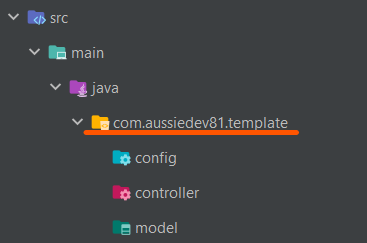

# Spring Boot Thymeleaf Template


This project template has 4 profiles which are all configured to use different data sources.
1. H2 database
2. MySQL database (local)
3. Postgres database (local)
4. Supabase database (also postgres)

To use them you will need to supply the appropriate details (except for the H2 database), and of course you can remove any you don't need.

Below is a few tips to get your project up and running quickly...
___
1. In [pom.xml](pom.xml), change the `groupId`, `artifactId`, `name`, and `description` to suit.  
    Make sure to rename the project file as well.
    ```xml 
    <groupId>com.aussiedev81</groupId>
    <artifactId>template</artifactId>
    <name>template</name>
    <description>Spring Boot project template with Thymeleaf and Spring Security</description>
    ```
    
2. Change your directory name to match the new `groupId` and `artifactId`


3. In [logback.xml](src/main/resources/logback.xml), change the logger name to match the new `groupId` (and `artifactId` if you want package specific loggers)
    ```xml
    <logger name="com.aussiedev81" level="info">
        <appender-ref ref="FILE" />
    </logger>
    ```
4. Save a run configuration and define the environment variables your program will need.  
For example:
```xml
<envs>
    <!--application-supabase.yml-->
    <env name="SUPABASE_URL" value="your_project_url" />
    <env name="SUPABASE_ANON_KEY" value="your_anon_key" />
    <env name="SUPABASE_JWT_SIGNER" value="your_JWT_signer" />
    <env name="SUPABASE_DATABASE_URL" value="your_connection_string (jdbc...(minus username and password))" />
    <env name="SUPABASE_DATABASE_USER" value="your_database_username" />
    <env name="SUPABASE_DATABASE_PASSWORD" value="your_database_password" />
    <!--application-mysql.yml-->
    <env name="MYSQL_DATABASE_URL" value="jdbc:mysql://localhost:3306/your_database_name" />
    <env name="MYSQL_DATABASE_USER" value="your_database_username" />
    <env name="MYSQL_DATABASE_PASSWORD" value="your_database_password" />
    <!--application-postgres.yml-->
    <env name="POSTGRES_DATABASE_URL" value="jdbc:postgresql://localhost:5432/your_database_name" />
    <env name="POSTGRES_DATABASE_USER" value="your_database_username" />
    <env name="POSTGRES_DATABASE_PASSWORD" value="your_database_password" />
</envs>
```

Happy coding! 😃